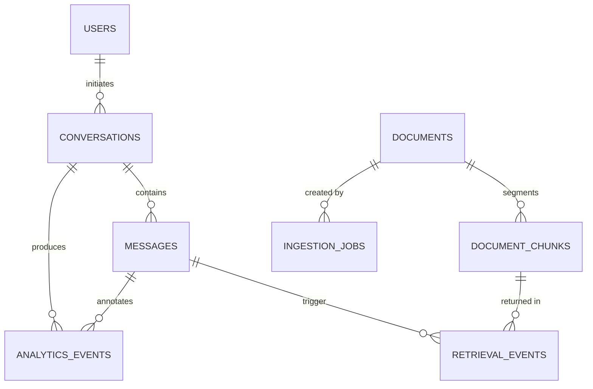
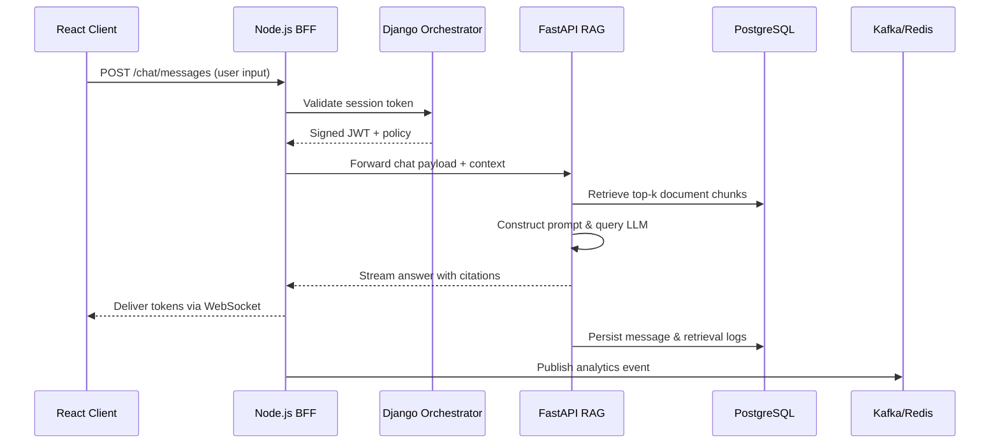
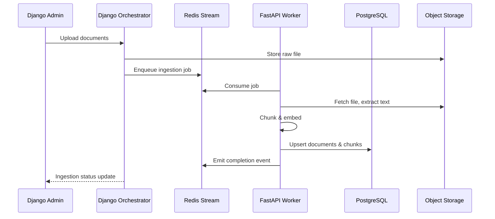
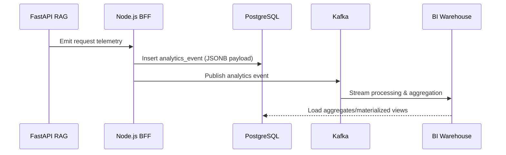

# Research Concierge System Design

## Overview
The Research Concierge platform pairs a Retrieval-Augmented Generation (RAG) microservice with orchestration layers and client applications to deliver enterprise research assistance. A FastAPI-based RAG service encapsulates ingestion, indexing, and semantic retrieval, while Django and Node.js orchestrators expose workflow automation, access control, and integrations with upstream systems. A React client presents conversational research tooling for analysts, and a shared PostgreSQL database records conversational state, document metadata, and analytics signals.

## Component Responsibilities
| Layer | Technology | Responsibilities |
| --- | --- | --- |
| Client | React + Next.js runtime | Conversational UI, document exploration, analytics dashboards, authentication handoff |
| API Orchestration | Django REST (internal systems), Node.js BFF (external apps) | Session/auth lifecycle, routing to RAG microservice, orchestration of multi-step workflows (task decomposition, summarization), caching, rate limiting |
| RAG Microservice | FastAPI + LangChain stack | Chunking & embedding pipeline, retrieval strategies (hybrid search, re-ranking), LLM prompting, response assembly, knowledge grounding |
| Data Layer | PostgreSQL + pgvector, Object storage | Vector store, metadata catalog, user/session state, analytics warehouse staging |
| Messaging | Redis Streams / Kafka | Asynchronous ingestion, workflow events, analytics logging fan-out |
| Observability | OpenTelemetry, Prometheus, Grafana | Distributed tracing across Django/Node/FastAPI, request metrics, vector search latency |

## Integration Model
- **Authentication & Authorization:** Django handles enterprise SSO, role management, and issues signed JWTs consumed by the Node.js gateway and FastAPI service. Node.js BFF refreshes tokens for the React client via silent renewal.
- **Request Routing:** React client invokes the Node.js BFF for conversational flows. BFF normalizes payloads, injects user context, and forwards to FastAPI. Django orchestrator provides admin APIs and batch workflows that directly call FastAPI for ingestion and knowledge management.
- **Shared Contracts:** pydantic schemas in FastAPI and TypeScript interfaces in Node.js mirror GraphQL/REST contracts. Event schemas are versioned in a schema registry for Kafka/Redis Streams.
- **Caching & Throttling:** Node.js gateway applies per-user rate limits and caches frequent retrieval results in Redis; FastAPI caches embeddings of repeat documents.
- **Error Handling:** Standardized error envelopes propagate through orchestrators, enriched with correlation IDs from OpenTelemetry traces.

## Data Flow
1. **Document Ingestion:** Django admin uploads documents to object storage, emits ingestion job to Redis Stream.
2. **Embedding Pipeline:** FastAPI workers consume jobs, extract text, chunk, embed using pgvector, and persist metadata + embeddings in PostgreSQL.
3. **Conversation Session:** React client posts chat messages to Node.js BFF, which validates session with Django, forwards to FastAPI.
4. **Answer Generation:** FastAPI retrieves relevant chunks, constructs prompt, invokes LLM, and responds with citations, logging analytics events.
5. **Analytics Aggregation:** Node.js writes usage events to PostgreSQL analytics tables and publishes to Kafka for downstream BI pipelines.

## PostgreSQL Schema Extensions
- **`documents`** – stores raw document metadata, ingestion source, compliance tags, storage URIs.
- **`document_chunks`** – references `documents`, stores chunk text, embedding vector (`vector` column via pgvector), token counts.
- **`conversations`** – tracks user sessions, persona, and orchestrator metadata.
- **`messages`** – chat history with role, message content, response latencies, FastAPI trace IDs.
- **`retrieval_events`** – logs top-k results per query, relevance scores, RAG configuration version.
- **`analytics_events`** – schema-on-read JSONB payload with event type, dimension keys, aggregated nightly into materialized views.
- **`ingestion_jobs`** – ingestion queue auditing, job state transitions, error payloads.
- **`feature_flags`** – toggles for experimentation across orchestrators and client.

## Scalability & Reliability
- Deploy FastAPI as horizontally scaled ASGI workers behind an API gateway. Vector-heavy requests use async background tasks to stream partial responses.
- Django and Node.js orchestrators run in separate autoscaling groups; Node.js BFF exposes a WebSocket gateway for live streaming and uses sticky sessions or token-based fan-out.
- PostgreSQL utilizes partitioning on time-based columns for `analytics_events` and `messages`, with read replicas for analytics workloads.
- Kafka topic retention ensures reprocessing of ingestion events; Redis Streams handle short-lived workflow commands.

## Security & Compliance
- Enforce field-level access controls in Django before issuing signed tokens.
- Enable row-level security in PostgreSQL for user-conversation data.
- Audit logging flows into `analytics_events` with PII hashing prior to export.
- FastAPI isolates prompt templates and secrets in a managed vault; orchestrators rotate API keys.

## High-Level Diagrams

### Entity-Relationship Diagram

### Chat Flow Sequence

### Ingestion Pipeline Sequence

### Analytics Logging Sequence

